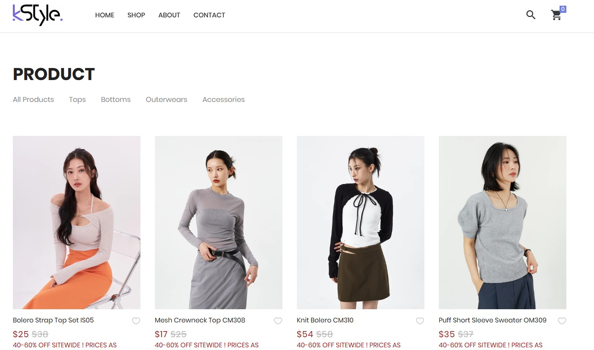
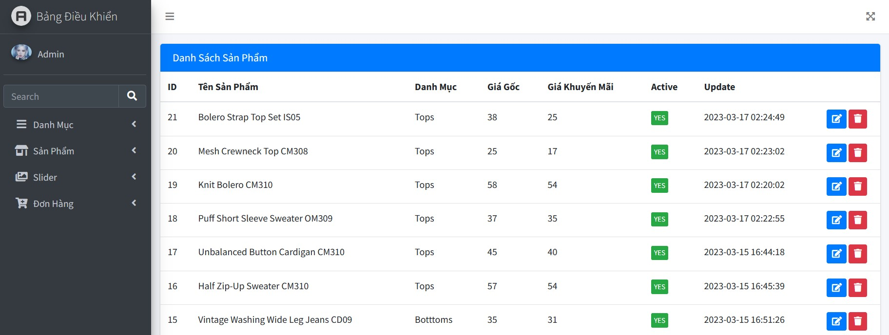

 ## KSTYLE SHOP

## Setting
 - Download the project on github and run the project with the command : php artisan serve
 - To connect to the database change : DB_DATABASE=database_name ; DB_USERNAME=database_username ; DB_PASSWORD=database_password in .env file
 - Create table in database with command : php artisan migrate in database/migrations

## About Project

This is a website that sells clothes for women in the style of Korean youth. Includes a variety of items, suitable for today's young people. It has an eye-catching interface that creates a good user experience. In addition, there will also be an admin Web site to help operate and manage work effectively

## Technology used
- Use [Laravel] version 8 for this project(https://laravel.com/).
- HTML/CSS , Javascript 
- Use [Boostrap] version 5 support make UI(https://getbootstrap.com/).

## Main function
 - Log in to get access to the dashboard
 - Add , Edit , Delete products , slider ,category in Admin panel
 - View order and user information
 - Add product to cart
 - Update and delete product in cart

## Overview Website

 - Customer UI
    

      
     

 - Admin Pannel

  

  
  

## Website source code
 - [Visit to get the link](https://github.com/minhlam3118410220/KStyle_Shop)

## License

The project makes it accessible to everyone to learn how to build a better website
